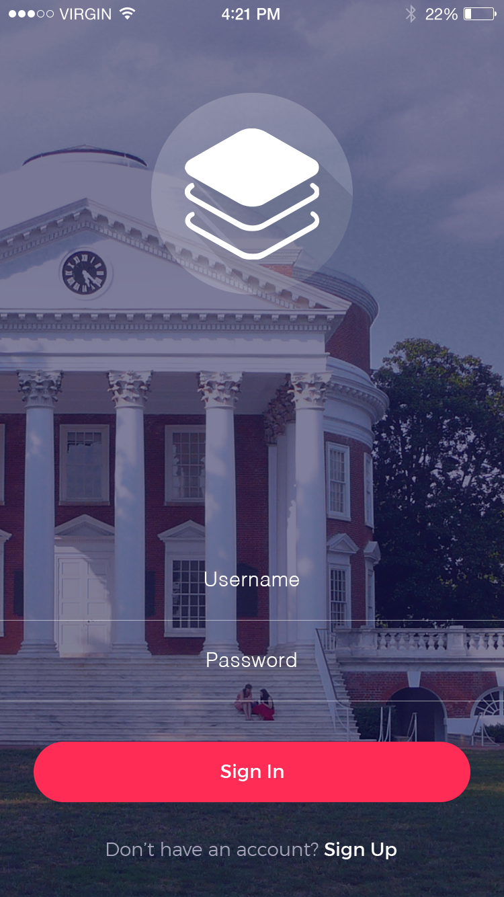

# Challenge #10  
#### React Native Styling  

  

Today you're going do some design. This is what makes an app go from an engineered function to a f*$king awesome experience.  

Design however cannot be left until the end. It should constantly be in the mind of the chief of product. Design is more than just colors and spacing, its about the experience. Today, however, we're just going to do colors and spacing. I hope you enjoy the experience.   

## Helpful Reading
If flexbox, css, or react-native are new to you, check out [this tutorial](http://moduscreate.com/aligning-children-using-flexbox-in-react-native/)  

If you want to jump right in, skip to The Project. You can always come back once you realize you made a mistake.  

## The Project  

### A Styled Login Screen
You are to build and style a React-Native login screen to match the screen seen below. Assets (a background and the logo) have been provided in the images folder. The typeface is Helvetica.  

#### Screen .png
